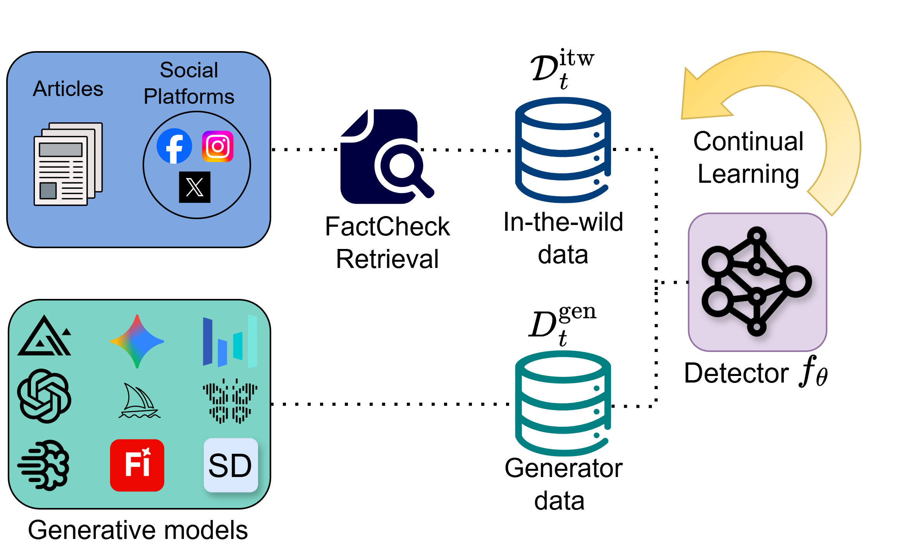
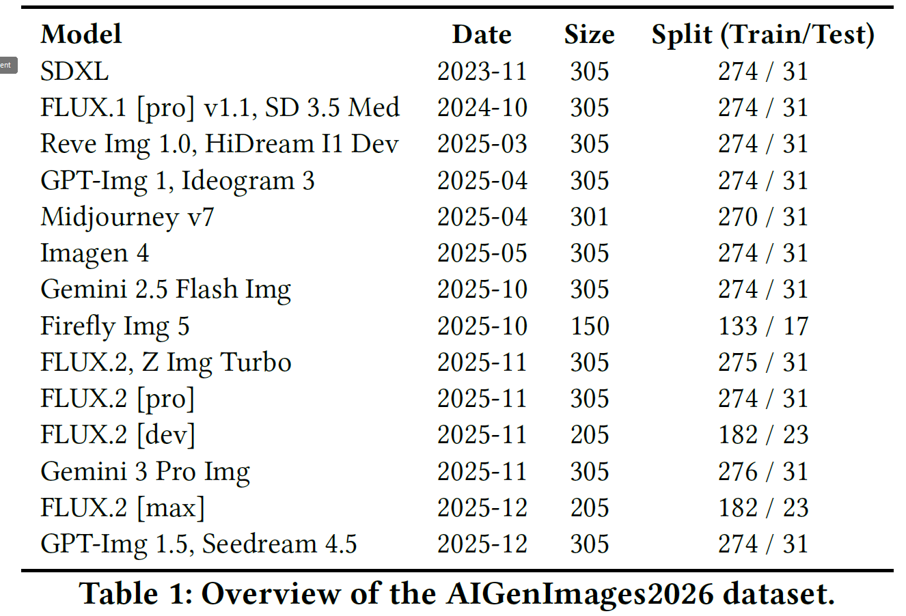

<div align="center">
 <br>

# Automated In-the-Wild Data Collection for Continual AI-Generated Image Detection

**Thanasis Pantsios, Dimitrios Karageorgiou, Christos Koutlis, George Karantaidis, Olga Papadopoulou, Symeon Papadopoulos**

CERTH-ITI, Thessaloniki, Greece

Presented at **MAD '26 – The 5th ACM International Workshop on Multimedia AI against Disinformation**

<p align="center">
  <a href='https://mever-team.github.io/WildFC/'>
    
  </a>
  <a href='https://arxiv.org/html/2605.02567v1'>
    
  </a>
  <a href='https://arxiv.org/pdf/2605.02567'>
    
  </a>
  <a href='https://huggingface.co/datasets/pthan12/WildFC'>
    
  </a>
  <a href='https://huggingface.co/datasets/pthan12/AIGenImages2026'>
    
  </a>
</p>

</div>

---

## 📄 Overview
This repository contains the official implementation and datasets for:

> **Automated In-the-Wild Data Collection for Continual AI-Generated Image Detection**

The proposed framework introduces a continual adaptive pipeline for robust AI-generated image detection under evolving real-world conditions.

<p align="center">
  
</p>

<p align="center">
  <em>Figure 1: Overview of the proposed framework.</em>
</p>

---

# Datasets

## AIGenImages2026 Dataset

AIGenImages2026 is a dataset of images generated by recent text-to-image generative models. You can find more details in the paper.

- Dataset Download: [Hugging Face Repository](https://huggingface.co/datasets/pthan12/AIGenImages2026)
- **5,439** generated images
- **19** recent generative models
- Chronologically organized generators

<p align="center">
  
</p>
<p align="center">
  <em> Example images from AIGenImages2026.</em>
</p>

<p align="center">
  
</p>

## WildFC Dataset

WildFC is an evolving in-the-wild dataset collected through an automated fact-check retrieval pipeline.

- Access Request: [Hugging Face Repository](https://huggingface.co/datasets/pthan12/WildFC)
- **2,884** AI-generated images
- **2,298** segmented image samples
- Real-world fact-checked AI-generated content

<p align="center">
  
</p>
<p align="center">
  <em> Example images from WildFC.</em>
</p>

# Training and Evaluation

Available pre-trained models of paper can be found here: [**RINE**](https://itigr-my.sharepoint.com/:u:/g/personal/apantsios_iti_gr/IQC79a-qFyAWQrjzZlNJirQ-Aetycm8v18GctRpEYaphT-U?e=5aqSi1), [**SPAI**](https://itigr-my.sharepoint.com/:u:/g/personal/apantsios_iti_gr/IQCkyy2RhxQBRZm_zwcDgeCvARhmym55JQ157RaxgnRIf1s?e=mbE0ve)

Guidelines for training and evaluation of our framework on RINE and SPAI can be found [here](detectors/rine/readme.md) and [here](detectors/spai/readme.md)

---

# Citation

If you use our datasets or framework in your research, please cite the following paper:

```bibtex
@inproceedings{pantsios2026wildfc,
  title={Automated In-the-Wild Data Collection for Continual AI Generated Image Detection},
  author={Pantsios, Thanasis and Karageorgiou, Dimitrios and Koutlis, Christos and Karantaidis, George and Papadopoulou, Olga and Papadopoulos, Symeon},
  booktitle={Proceedings of the 5th ACM International Workshop on Multimedia AI against Disinformation (MAD '26')},
  year={2026}
}
```

---

# Acknowledgments

This work received funding from:

- AI-CODE (GA No. 101135437)
- ELIAS (GA No. 101120237)

---

# Contact

If there are any questions, please feel free to contact:

**Thanasis Pantsios**  
📧 apantsios@iti.gr
